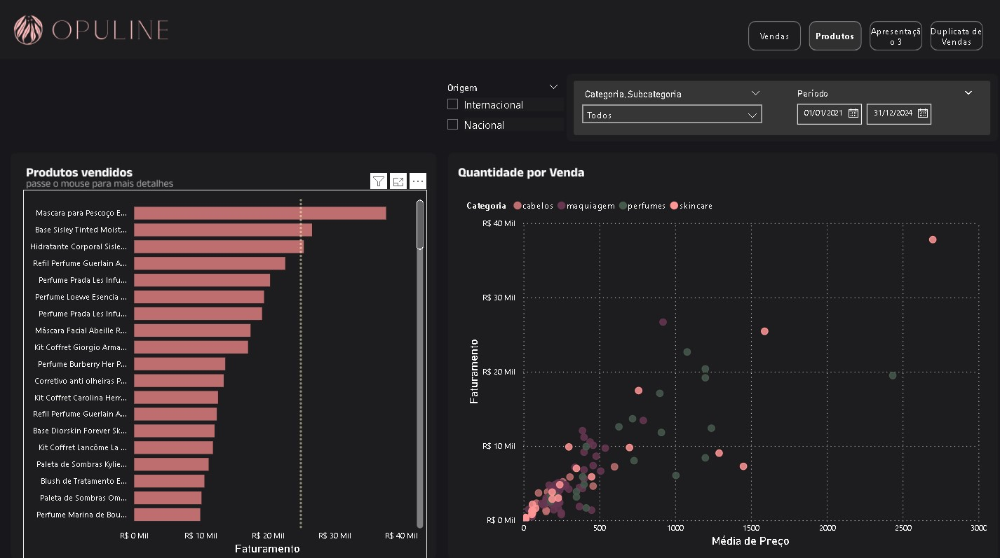
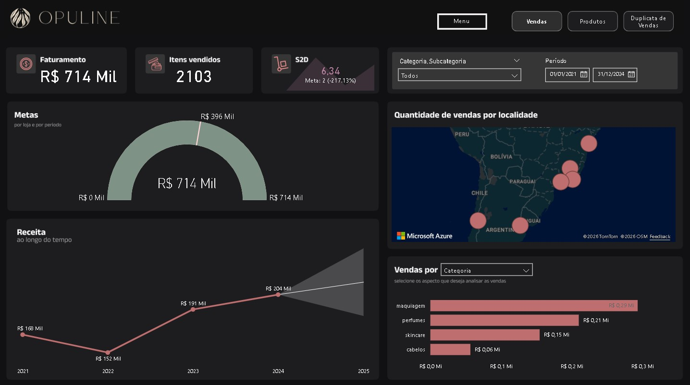

#  Projeto Opuline: Dashboard Estratégico de Vendas e Logística

> **Nota:** Este é um projeto construído com dados fictícios, desenvolvido para fins de estudo e demonstração prática de competências avançadas em Business Intelligence e Power BI.

A **Opuline** é uma empresa de cosméticos que busca uma cultura *data-driven*. Este projeto consistiu em desenvolver um relatório interativo e visualmente estratégico, ajudando a empresa a identificar padrões de vendas, tendências temporais e oportunidades de melhoria logística.

## 📊 Detalhamento das Análises

##  Objetivos do Projeto
* Mapear o faturamento por categorias, marcas e origem dos produtos (Nacional vs. Internacional).
* Monitorar o desempenho da meta de entrega logística (**Ship-to-Door**).
* Acompanhar o cumprimento das metas financeiras mensais.
* Aplicar recursos estatísticos para identificar anomalias e prever faturamentos futuros.
* Criar uma experiência de usuário (UX) fluida com navegação entre páginas e dicas de ferramentas personalizadas (Tooltips).

##  Tecnologias e Ferramentas
* **Power BI Desktop:** Modelagem, cálculos e construção de relatórios.
* **Linguagem DAX:** Criação de métricas de negócio e parâmetros dinâmicos.
* **Inteligência Artificial (PBI):** Linhas de tendência, Previsão (Forecast) e Detecção de Anomalias.
* **UX/UI Design:** Importação de layouts customizados, uso de paleta de cores hexadecimal (#BD6E6E, #663651, etc.) e botões de navegação.

##  Estrutura e Modelagem de Dados
O modelo de dados foi estruturado em **Star Schema** (Esquema Estrela), otimizando a performance do relatório:
* **Tabela Fato:** `fPedidos` (Registro de vendas, datas e tempo de entrega).
* **Tabelas Dimensão:** `dMarcas`, `dProdutosFinais`, `dCategoriasProdutos`, `dMetaMensal` e `Calendário`.
* **Tabelas de Apoio:** Tabela exclusiva para `_Medidas` e `Fatores`.

## 📈 Principais Análises e Recursos Aplicados

### 1. Parâmetros de Campos (Interatividade Avançada)
Para otimizar o espaço do relatório, foi criado um **Parâmetro de Campos**, permitindo que o usuário alterne dinamicamente a visão do gráfico de barras para comparar o faturamento entre *Origem*, *Marca* ou *Categoria* com apenas um clique.

### 2. Dicas de Ferramenta Personalizadas (Tooltips)
Foi desenvolvida uma página oculta de "Dica de ferramenta" contendo o visual **Image Grid**. Ao passar o mouse sobre as barras de faturamento por produto, o usuário visualiza instantaneamente a foto real do produto comercializado.

### 3. Séries Temporais, Previsões e Anomalias
* **Linha de Tendência:** Aplicada para entender a direção geral do crescimento das vendas.
* **Previsões (Forecast):** Projeção de faturamento para 1 ano à frente, utilizando um intervalo de confiança de 95% para planejamento de cenários (otimista, provável e pessimista).
* **Detecção de Anomalias:** Recurso habilitado para identificar picos positivos e quedas bruscas de faturamento fora do padrão esperado.

### 4. Monitoramento de Metas e Logística
* **KPI Ship-to-Door:** Monitoramento do tempo de envio ao cliente. A lógica foi invertida (*Baixo é bom*), comparando o tempo real (ex: 6,34 dias) contra a meta (8 dias).
* **Indicador de Meta (Gauge):** Visualização no formato velocímetro comparando o faturamento total com a `dMetaMensal`.

### 5. Análise de Dispersão e Mapa
* **Gráfico de Dispersão (Scatter Plot):** Cruzamento de duas variáveis (*Preço* no Eixo X e *Faturamento* no Eixo Y) para identificar produtos de alto valor agregado e baixa saída, ou itens baratos de alta rotatividade.
* **Mapa:** Análise geográfica mostrando o faturamento médio em cidades da América do Sul (São Paulo, Rio de Janeiro, Buenos Aires, Santiago, etc.), com escala de cores gradiente.

---
*Projeto desenvolvido por David Felipe Moreira de Souza como parte do portfólio de Data Science e Análise de Dados.*
